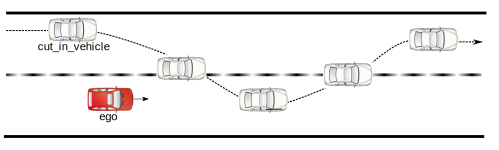

In the **aborted_vehicle_cut_in** scenario, the cut-in vehicle is driving in a lane adjacent to the Ego. The cut-in vehicle starts performing a cut-in maneuver into the Ego's lane in front of the Ego and suddenly aborts the maneuver and cuts out in the opposite direction from the cut-in maneuver.
For a valid scenario, the cut-in vehicle's invasion of the Ego's lane must be performed in front of the Ego.

<figure>
    
    <figcaption>Figure 1: Aborted vehicle cut-in</figcaption>
</figure>

## Scenario phases
The phase descriptions are as follows:

### `phase_ego_warm_up`

**Ego:** The Ego starts driving at `ego_speed_at_start` in one lane.

**cut_in_vehicle:** The cut-in vehicle starts driving at `cut_in_vehicle_speed_at_start` in the lane adjacent to the Ego. The cut-in vehicle has an initial lateral lane offset of `cut_in_vehicle_lat_offset_at_start`. At the end of this phase, the cut-in vehicle is ahead of the Ego by `cut_in_vehicle_time_gap_to_ego_at_initial_phase_end`.

### `phase_essence_lane_change` 

**Ego:** The Ego continues driving and attempts to stay in the same lane and maintain the same speed.

**cut_in_vehicle:** The cut-in vehicle performs a cut-in maneuver into the Ego's lane from the left or right lane adjacent to the Ego. At the end of this phase, the cut-in vehicle is ahead of the Ego by `ego_time_gap_to_cut_in_vehicle_at_change_lane_end` and has a lateral lane offset of `cut_in_vehicle_lat_offset_at_lane_change_end`.

### `phase_essence_abort` 

**Ego:** The Ego continues driving and attempts to maintain the same speed.

**cut_in_vehicle:** The cut_in_vehicle aborts the cut-out maneuver and cuts out of the Ego's lane back into the adjacent lane on the side from which it started the cut-in maneuver. At the end of this phase the cut_in_vehicle is back in its target lane and reaches the final lateral offset of `cut_in_vehicle_lat_offset_at_end`. 

### `phase_post` 

**Ego:** The Ego continues driving and attempts to maintain the same speed.

**cut_in_vehicle:** The cut-in vehicle continues driving, attempting to maintain its lane and speed.

Parameter | Description | Range
-- | -- | --
`gen_cut_in_vehicle_lat_offset_at_lane_change_end` | Lateral offset of the cut_in_vehicle at the end of phase_essence_lane_change | [-1..1]m
`gen_cut_in_vehicle_speed_at_start` | Input speed of the cut_in_vehicle at the start | [0..150]kph
`gen_cut_in_vehicle_rel_speed_to_ego_at_start` | Input relative speed of the cut_in_vehicle at the start | [-10..10]kph
`gen_cut_in_side` | Input side from which the vehicle cuts in | left, right
`gen_ego_time_gap_to_cut_in_vehicle_at_change_lane_start` | Input time gap between the Ego and the cut_in_vehicle at the start of lane change | [1..5]s
`gen_ego_time_gap_to_cut_in_vehicle_at_change_lane_end` | Input time gap between the Ego and the cut_in_vehicle at the end of lane change | [1..5]s
`gen_cut_in_vehicle_lat_offset_at_start` | Lateral offset of the cut_in_vehicle at start | [-1..1]m
`gen_cut_in_vehicle_lat_offset_at_end` | Lateral offset of the cut_in_vehicle at end | [-1..1]m
`gen_ego_speed_at_start` | Input speed of the Ego | [0..150]kph

[//]: # ($$input)

[//]: # ($$metrics)

## Metrics
Metrics collected during test execution are given below.

### Coverage
The coverage metrics are given below.

#### Coverage items
The multi-dimensional situations captured during the test execution are as follows:

[//]: # ($$coverage)

Item | Description | Range | Unit/Type
-- | -- | -- | --
`ego_lon_distance_to_cut_in_vehicle_at_abort_end` | How far ahead is the cut_in_vehicle relative to Ego at the end of phase_essence_abort | [0..0.5), [0.5..1), [1..1.5), [1.5..2), [2..2.5), [2.5..3), [3..3.5), [3.5..4), [4..4.5), [4.5..5), [5..6), [6..7), [7..8), [8..9), [9..10), [10..11), [11..12), [12..13), [13..14), [14..15), [15..20), [20..25), [25..30), [30..35), [35..40), [40..45), [45..50), [50..55), [55..60) | m
`ego_speed_at_abort_end` | Speed of the Ego at the end of phase_essence_abort | [0..150), every: 10.0 | kph
`initial_phase_duration` | Duration of the entire phase_ego_warm_up | [2..8), every: 1.0 | s
`lane_change_duration` | Duration of the entire phase_essence_lane_change | [3..7), every: 1.0 | s
`abort_duration` | Duration of the entire phase_essence_abort | [3..6), every: 1.0 | s
`ego_rel_speed_to_cut_in_vehicle_at_abort_end` | Relative speed of the cut_in_vehicle to the Ego at the end of phase_essence_abort | [-70..30), every: 10.0 | kph
`cut_in_vehicle_max_lat_offset_to_lane_center_at_lane_change` | How deep the cut_in_vehicle goes into Ego-lane before it decides to get back to its lane | [-1..1), every: 0.5 | m
`cut_in_vehicle_mean_acceleration_at_lane_change_phase` | The mean acceleration of the cut_in_vehicle during phase_essence_lane_change | [-2..2), every: 0.2 | mpsps
`cut_in_vehicle_lat_offset_at_lane_change_end` | Lateral offset of the cut_in_vehicle at the end of phase_essence_lane_change | [-1..1), every: 0.5 | m
`cut_in_vehicle_mean_acceleration_at_abort_phase` | The mean acceleration of the cut_in_vehicle during phase_essence_abort | [-2..2), every: 0.2 | mpsps
`gen_cut_in_vehicle_lat_offset_at_lane_change_end` | Lateral offset of the cut_in_vehicle at the end of phase_essence_lane_change | [-1..1), every: 0.5 | m

[Click] The coverage items inherited from the <b>sut.vehicle_cut_in_common</b> scenario are as follows:

Item | Description | Range | Unit/Type
-- | -- | -- | --
`cut_in_variant` | The variant of the cut_in scenario family | vehicle_cut_in, aborted_cut_in, non_smooth_cut_in, cut_in_out_of_traffic, double_cut_in | cut_in_variant
`cut_in_vehicle_speed_at_scenario_start` | Speed of the cut_in_vehicle at start | [0..150), every: 10.0 | kph
`cut_in_vehicle_position_to_ego` | The position and speed of the cut_in_vehicle wrt Ego at the start | cut_in_vehicle_is_behind_and_faster, cut_in_vehicle_is_ahead_and_slower | cut_in_vehicle_position_to_ego
`cut_in_vehicle_speed_at_scenario_end` | Speed of the cut_in_vehicle at the end | [0..150), every: 10.0 | kph
`gen_cut_in_vehicle_speed_at_start` | Input speed of the cut_in_vehicle at the start | [0..150), every: 10.0 | kph
`cut_in_vehicle_speed_at_start` | Speed of the cut_in_vehicle at the start | [0..150), every: 10.0 | kph
`gen_cut_in_vehicle_rel_speed_to_ego_at_start` | Input relative speed of the cut_in_vehicle at the start | [-10..10), every: 10.0 | kph
`cut_in_vehicle_rel_speed_to_ego_at_start` | Relative speed of the cut_in_vehicle at the start | [0..150), every: 10.0 | kph
`gen_cut_in_side` | Input side from which the vehicle cuts in | left, right | av_side
`gen_ego_time_gap_to_cut_in_vehicle_at_change_lane_start` | Input time gap between the Ego and the cut_in_vehicle at the start of lane change | [1..5), every: 0.5 | s
`gen_ego_time_gap_to_cut_in_vehicle_at_change_lane_end` | Input time gap between the Ego and the cut_in_vehicle at the end of lane change | [1..5), every: 0.5 | s
`gen_cut_in_vehicle_lat_offset_at_start` | Lateral offset of the cut_in_vehicle at start | [-1..1), every: 0.5 | m
`cut_in_vehicle_lat_offset_at_start` | Lateral offset of the cut_in_vehicle at start | [-1..1), every: 0.5 | m
`gen_cut_in_vehicle_lat_offset_at_end` | Lateral offset of the cut_in_vehicle at end | [-1..1), every: 0.5 | m
`ego_distance_to_cut_in_vehicle_at_change_lane_start` | How ahead is the cut_in_vehicle relative to the Ego at change_lane start | [0..0.5), [0.5..1), [1..1.5), [1.5..2), [2..2.5), [2.5..3), [3..3.5), [3.5..4), [4..4.5), [4.5..5), [5..6), [6..7), [7..8), [8..9), [9..10), [10..11), [11..12), [12..13), [13..14), [14..15), [15..20), [20..25), [25..30), [30..35), [35..40), [40..45), [45..50), [50..55), [55..60) | m
`ego_speed_at_change_lane_start` | Speed of the Ego at change_lane start | [0..150), every: 10.0 | kph
`cut_in_vehicle_rel_speed_to_ego_at_change_lane_start` | How much faster is the cut_in_vehicle relative to the Ego at change_lane start | [-70..30), every: 10.0 | kph
`ego_lane` | Relative Ego lane within road (innermost/middle/outermost) | innermost, outermost, middle | lane_relative_side
`cut_in_vehicle_cuts_in_from_side` | The cut_in_vehicle cuts-in from left/right of the Ego | left, right | av_side
`ego_relative_time_distance_to_cut_in_vehicle_at_change_lane_start` | Ego relative time distance to the cut_in_vehicle at change lane start | [-6..6), every: 0.5 | s
`road_curvature_at_change_lane_start` | Curvature of the road at change lane start | other, straightish, soft_left, hard_left, soft_right, hard_right | curvature
`cut_in_vehicle_lat_offset_at_cut_in_start` | Lane offset of the cut_in_vehicle at start of cut_in phase | [-1..1), every: 0.5 | m
`cut_in_side` | The side from which the vehicle cuts in | left, right | av_side
`ego_time_gap_to_cut_in_vehicle_at_change_lane_start` | Ego time gap to the cut_in_vehicle at the start of lane change | [1..5), every: 0.5 | s
`ego_distance_to_cut_in_vehicle_at_change_lane_end` | How far ahead is the cut_in_vehicle relative to the Ego at change_lane end | [0..0.5), [0.5..1), [1..1.5), [1.5..2), [2..2.5), [2.5..3), [3..3.5), [3.5..4), [4..4.5), [4.5..5), [5..6), [6..7), [7..8), [8..9), [9..10), [10..11), [11..12), [12..13), [13..14), [14..15), [15..20), [20..25), [25..30), [30..35), [35..40), [40..45), [45..50), [50..55), [55..60) | m
`ego_speed_at_change_lane_end` | Speed of the Ego at change_lane end | [0..150), every: 10.0 | kph
`cut_in_vehicle_rel_speed_to_ego_at_change_lane_end` | How much faster is the cut_in_vehicle relative to the Ego at change_lane end | [-70..30), every: 10.0 | kph
`ego_relative_time_distance_to_cut_in_vehicle_at_change_lane_end` | Ego relative time distance to the cut_in_vehicle at change lane end | [-6..6), every: 0.5 | s
`cut_in_duration` | The time taken by the cut_in_vehicle to perform the cut_in | [0.5..3), every: 0.5 | s
`cut_in_vehicle_lat_offset_at_cut_in_end` | Lane offset to the cut_in_vehicle at end of cut_in phase | [-1..1), every: 0.5 | m
`ego_time_gap_to_cut_in_vehicle_at_change_lane_end` | Ego time gap to the cut_in_vehicle at the end of lane change | [1..5), every: 0.5 | s
`ego_slowed_down` | Did the Ego slow down | true, false | bool
`cut_in_vehicle_lat_offset_at_end` | Lateral offset of the cut_in_vehicle at end | [-1..1), every: 0.5 | m
